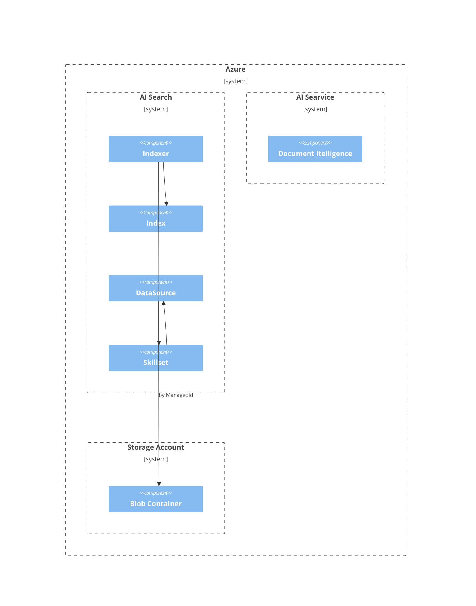

# pf-talentsearch

```mermaid
C4Context
    Boundary(b0,"Azure") {
        Boundary(b1, "AI Search"){
            Component(indexer,"Indexer")
            Component(index,"Index")
            Component(datasrc,"DataSource")
            Component(skillset,"Skillset")
        }
        Boundary(b2,"AI Searvice"){
            Component(c21,"Document Itelligence")
        }
        Boundary(b3,"Storage Account"){
            Component(blob,"Blob Container")
        }
    }

    Rel(datasrc,blob,"by ManagedId")
    Rel(skillset,datasrc,"")
    Rel(indexer,skillset,"")
    Rel(indexer, index,"")

```

Firebase ( front )
    ↓
Cloud Function Integration ( back )
    ↓
Vertex AI ( search Engine )

PEODAMA people data management