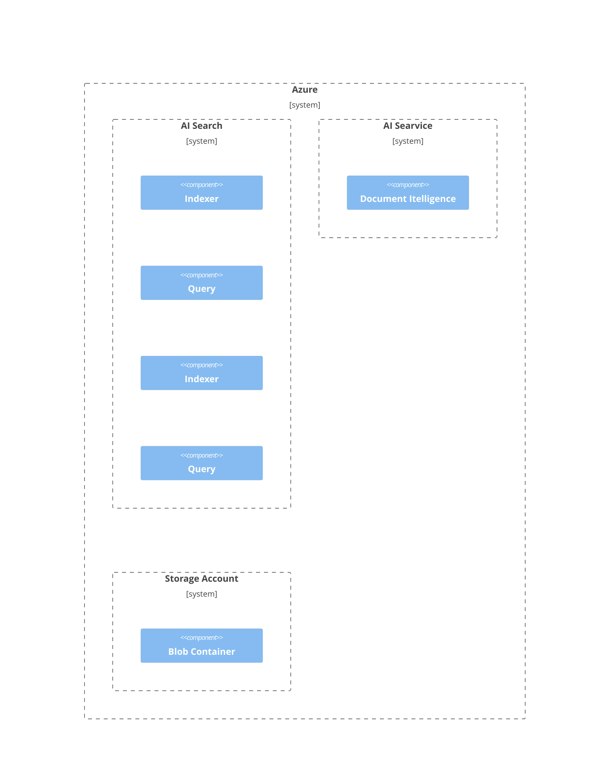

Azure
===

```mermaid
C4Context
    Boundary(b0,"Azure") {
        Boundary(b1, "AI Search"){
            Component(c11,"Indexer")
            Component(c12,"Query")
            Component(c13,"Indexer")
            Component(c14,"Query")
        }
        Boundary(b2,"AI Searvice"){
            Component(c21,"Document Itelligence")
        }
        Boundary(b3,"Storage Account"){
            Component(c31,"Blob Container")
        }
    }
    


```

