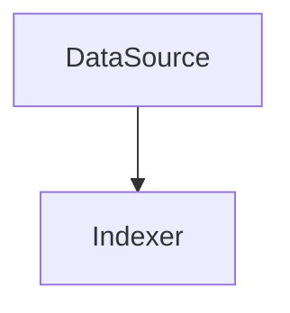
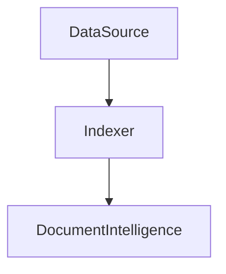

Skillset
===


 /document/content : For blobs, the source is usually the blob's content property.

```json
{
    "document": {
        "content":{


        },
    }
}
```


### skil
```json
{
      "name": "documentInteligence",
      "description": "Analyze a document by DocumentIntelligenceLayoutSkill",
      "context": "/document",
      "outputMode": "oneToMany",
      "markdownHeaderDepth": "h6",
      "@odata.type": "#Microsoft.Skills.Util.DocumentIntelligenceLayoutSkill",
      "inputs": [
        {
          "name": "file_data",
          "source": "/document/file_data"
        }
      ],
      "outputs": [
        {
          "name": "content",
          "targetName": "pdfDocument"
        }
      ]
    }
```
### input

PDF fileを入れてDocument Intelligenceスキルを実行。
結果はContentの中に平文で入るだけでOCRと変わらず。


### output
```json
{
    "document": {
        "pdfDocument":{
            "content": "\n2019年 8月 23日現在 \n\n職務・履歴経歴書 \n\n \n■最終学歴： \n\n2006 年 3 ⽉ 東京電機⼤学 ⼯学部第⼆部 卒業 \n■資格： \n\n2002 年 11 ⽉ 基本情報技術者資格取得 …",
            "id": "aAB0AHQAcABzADoALwAvAG0AZgBwAGYAdABtAHIAZQBzAHUAbQBlAC4AYgBsAG8AYgAuAGMAbwByAGUALgB3AGkAbgBkAG8AdwBz…",
            "metadata_author": "得上竜一",
            "metadata_content_type": "application/pdf",
            "metadata_creation_date": "2019-08-25T22:32:56Z",
            "metadata_language": "en",
            "metadata_storage_content_md5": "WsnALWWPQRVGQ8JUlp4NGg==",
            "metadata_storage_content_type": "application/pdf",
            "metadata_storage_file_extension": ".pdf",
            "metadata_storage_last_modified": "2025-01-17T22:12:48Z",
            "metadata_storage_name": "職務経歴書・履歴書(得上竜一2019).pdf",
            "metadata_storage_path": "https://mfpftmresume.blob.core.windows.net/resume/%E8%81%B7%E5%8B%99%E7%B5%8C%E6%AD%B4%E6%9B%B8%E3%8…",
            "metadata_storage_sas_token": "",
            "metadata_storage_size": 270288,
            "metadata_title": "職務経歴書・履歴書(得上竜一2019)",
            "pdfDocument": null
        },
    }
}
```

contentとして抽出はできているが、項目別に取得はできていない。


